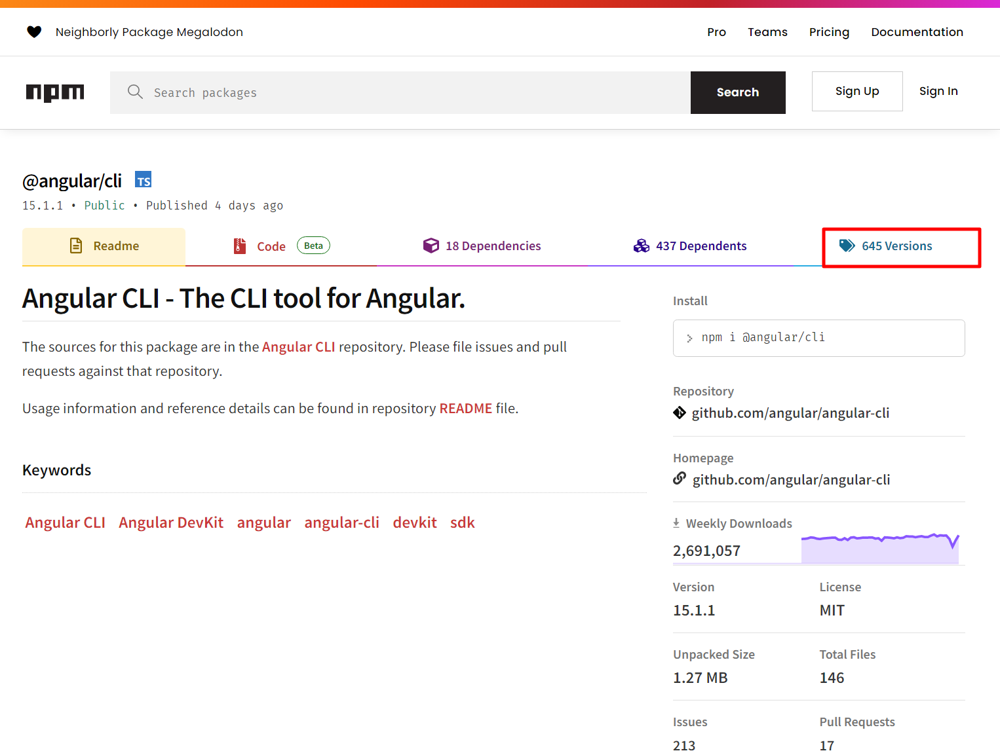
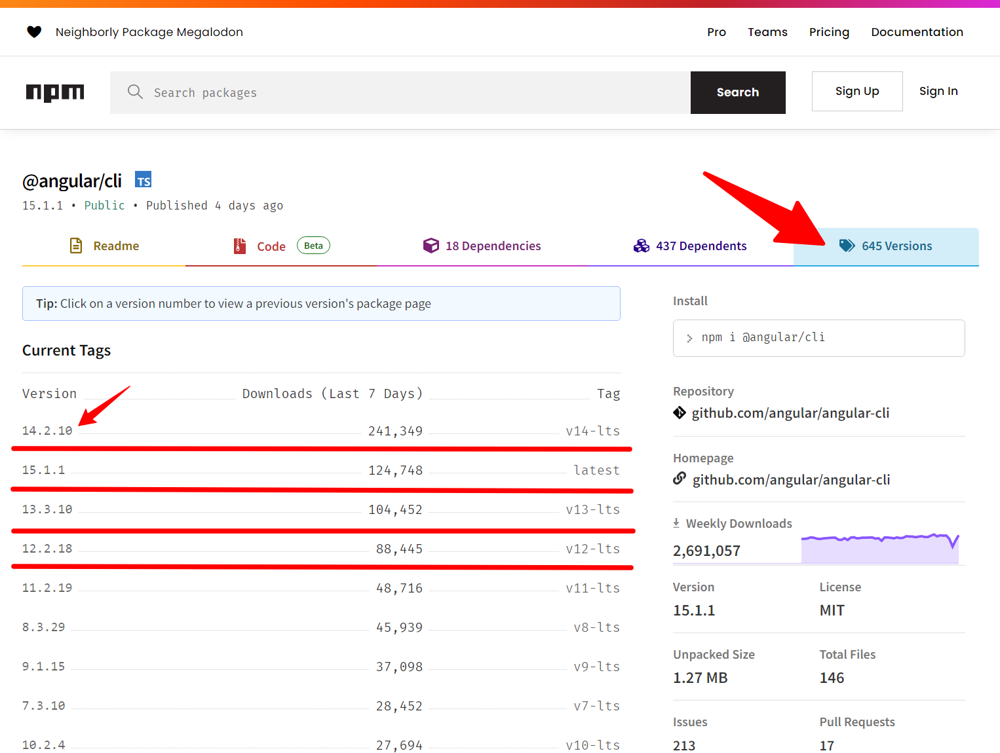

# Ejemplo 01 - Instalar Angular CLI

## Objetivo

* Instalar Angular CLI.
* Identificar las diferentes versiones de Angular.
* Conocer los principales comandos de Angular CLI.

Aquí se debe agregar el desarrollo del ejemplo.

1. Navegar al [repositorio oficial](https://www.npmjs.com/package/@angular/cli) de Angular CLI de NPM.

Aquí encontraremos todas las versiones disponibles para instalar Angular CLI.

Visualizaremos todas las versiones lanzadas previamente para en caso de necesitar alguna es específico poder instalarla en nuestros equipos sin problemas.

2. Instalar Angular CLI.

Para instalar la última versión de Angular CLI disponible utilizamos el comando:

`npm i -g @angular/cli`

Si deseamos una versión anterior por ejemplo la 14:

`npm i -g @angular/cli@14.2.10`

3. Una vez instalado puedes corroborar tu versión instalada con el siguiente comando:

`ng version`

Si quieres conocer más a profundidad de Angular CLI lo puedes consultar en su [documentación oficial](https://angular.io/cli).

