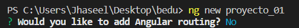
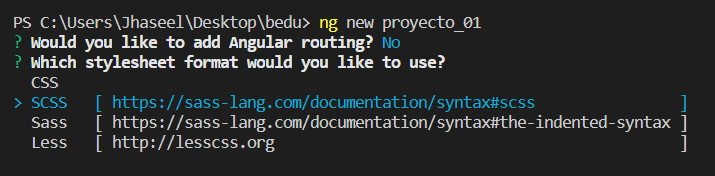
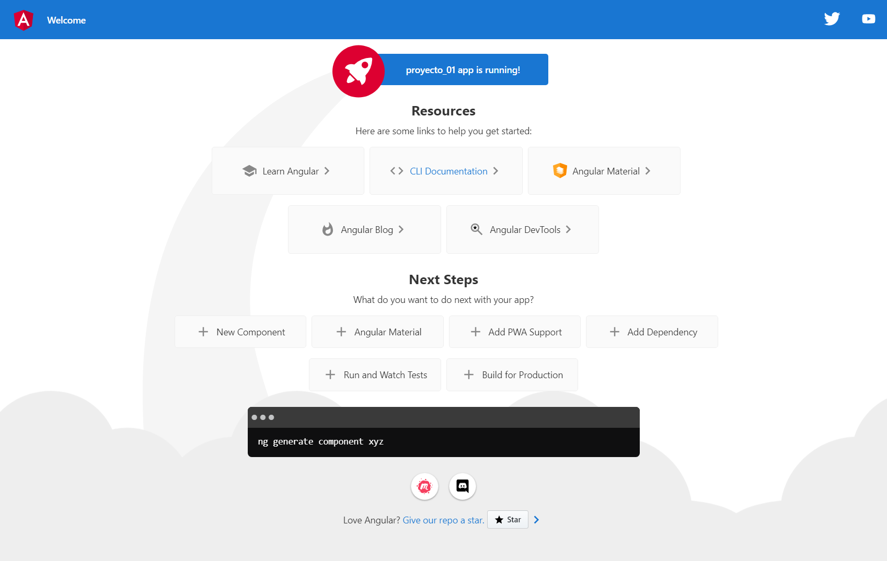

# Ejemplo 02 - Primer proyecto en Angular

## Objetivo

* Identificar los pasos para crear un proyecto de Angular.

## Desarrollo

1. Para crear un proyecto utilizaremos Angular CLI. Para esto debemos situarnos con nuestra consola en el directorio donde deseemos guardarlo, y ejecutar el siguiente comando:

`ng new <nombre_del_proyecto>`

por ejemplo:

`ng new proyecto_01`

2. Lo primero que nos preguntará es si deseamos añadir angular Rounting. Por el momento seleccionaremos que no.

3. Enseguida nos preguntará qué procesador de estilos deseamos utilizar, podemos seleccionar alguno usando las flechas del teclado y pulsando enter.
 
Pueden seleccionar el que guste, yo les recomiendo usar SCSS.

4. Al terminar la consola te mostrará un mensaje de éxito:
 
>   Successfully initialized git.
    Nothing to be done.
 
 
5. con la consola, accederemos a el nuevo directorio creado con el nombre que le asignamos a nuestro proyecto, en este caso 'proyecto_01'.
 
`cd proyecto_01`
 
 
6. Ahora levantaremos nuestro servidor de Angular usando el siguiente comando:
 
`ng serve`
 
Debemos ver un mensaje de éxito después de algunos segundos, la primera vez también nos puede preguntar sobre compartir datos de uso del proyecto con el equipo de Angular, queda a su elección aceptar o rechazar.
 

 
7. Una vez nuestro servidor está compilado, abriremos nuestro navegador y entraremos a la siguiente URL: http://localhost:4200.
 

 
Con estos sencillos pasos tienes tu primera página web con Angular.
