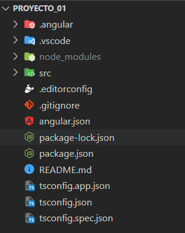

# Ejemplo 02 - Estructura de archivos en proyectos Angular
## Objetivo
 
* Identificar los principales archivos generados en nuestros proyectos.
 
## Desarrollo
 
Una vez creado nuestro proyecto, lo podemos abrir desde nuestro editor de código, donde veremos que se generaron automáticamente varios archivos y carpetas.
 

 
* Carpeta *node_modules*
    En esta carpeta se almacenarán todos los paquetes relacionados con nuestro proyecto, como lo son librerías de componentes, herramientas de compilación o de pruebas unitarias.
 
* Carpeta *src*
    En esta carpeta se almacena todo el código relacionado a nuestro proyecto.
 
    * Carpeta *app*
        En esta carpeta se almacena todo lo relacionado a TypeScprint como lo son nuestros componentes o módulos.
        * Archivo *app.module.ts*
            Cada proyecto de Angular tiene al menos una clase ngModule, este archivo es considerado el módulo raíz.
       
        * Archivos *app.component.(html|ts|scss|spec.ts)*
            Estos 4 archivos forman parte del componente raíz de la aplicación, y cada que creemos un componente obtendremos estos 4 archivos.
 
    * Carpeta *assets*
        En esta carpeta se almacena todo lo relacionado a recursos de la aplicación, como lo son hojas de estilo, imágenes, tipos de fuente, videos, audios etc...
 
    * Archivo *index.html*
        Es la página principal de la aplicación, se encarga de la referencia hacia los archivos de estilos y scripts.
 
    * Archivo *styles.scss*
        Archivo principal de estilos.
 
* Archivo *angular.json*
Este archivo contiene la configuración default para nuestra línea de comandos CLI, incluyendo opciones de configuración para realizar compilables, levantar nuestro servidor local, herramientas de testing.
 
* Archivo *package.json*
Contiene la configuración de paquetes npm disponibles para el proyecto. https://angular.io/guide/npm-packages.
