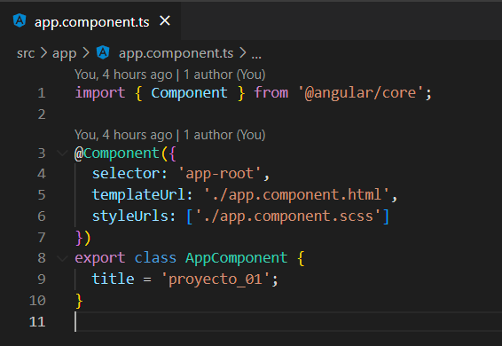

# Ejemplo 02 - Introducción a TypeScript
## Objetivo
 
* Conocer las principales características de TypeScript.
 
## Desarrollo

Una vez identificada la estructura de nuestro proyecto, accederemos a nuestro componente principal generado al crear el proyecto en:
 
    src/app/app.component.*
 
Recordando el patrón Model-View-Controller identificamos su implementación en los componentes los cuales están formados por 4 archivos:
   
  * **nombre_componente.app.html**: (VIEW) Aquí añadiremos todo lo relacionado a la interfaz de usuario y es responsable de mostrar los datos del modelo.
  * **nombre_componente.app.scss**: (VIEW) Este archivo contiene todos los estilos relacionados al componente, estos estilos sólo aplican dentro del componente.
  * **nombre_componente.app.ts**: (CONTROLLER) Aquí se controlan los servicios de la aplicación y lógica de la vista y modelos para añadirle funcionalidad a nuestro componente.
  * **nombre_componente.app.spec.ts**: Este archivo es opcional y sirve para crear nuestras pruebas unitarias.

Por ahora solo ocuparemos el archivo de lógica de nuestro componente *nombre_componente.app.ts*



Los componentes de angular están formados por una clase de TypeScript.
 
Una clase en TypeScript se define utilizando la palabra reservada "class" seguida del nombre de la clase.
Dentro de la clase podemos declarar propiedades y objetos, además todas las clases poseen un constructor el cual se utiliza para inicializar nuestra clase.

```TypeScript
class AppComponent {

    constructor() {
    }
}

```

TypeScript nos ofrece un conjunto de tipos de datos básicos para declarar variables y definir su estructura de datos en la aplicación. Los principales son:
    * number: para números enteros y decimales.
    * string: para cadenas de texto.
    * boolean: para valores lógicos.
    * any: para cualquier tipo de valor.
    * void: para indicar que una función no devuelve ningún valor.
    * Array: para almacenar colecciones de objetos o elementos del mismo tipo de datos.
 
Para declarar un tipo de dato usamos la siguiente estructura:

```typescript
class AppComponent {

    propiedad1: string;
    propiedad2 = "";
    
    propiedad3: number;
    propiedad4: 10;

    constructor() {
    }

}
```

Las funciones en TypeScript son un bloque de código reutilizable que se puede ejecutar varias veces con diferentes valores de entrada.

```typescript
class AppComponent {

    propiedad1: string;
    propiedad2 = '';
    
    propiedad3: number;
    propiedad4: 10;

    constructor() {
    }

    function1() {
        //...
    }

    function2(parametro: string, parametro2: number): void {
        //...
    }

    getText (): string {
    return '';
  }

}
```

En TypeScript las variables son espacios de almacenamiento temporal en memoria para almacenar valores, se declaran utilizando  las palabras reservadas "var", "let", "const" seguido del nombre de la variable y el valor asignado.
 
* var: tienen un alcance global y su valor puede ser reasignado, actualmente no se recomienda su uso, en su lugar se recomienda usar const o let según la necesidad.
* let: tienen un alcance en bloque, por ejemplo solo dentro de una función, una clase o una estructura if o for y su valor puede ser asignado.
* const: tienen un alcance de bloque, y su valor no puede ser asignado.

```typescript
class AppComponent {
    
    constructor() {
      this.contador();
    }
    
    contador() {
        const limite = 10;
        let contador = 0;
        contador = contador + 1;
    }
}
```