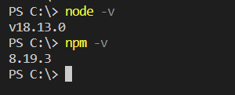

## Sesión 1: Introducción a Angular y Typescript. 🤖

### 1. Objetivos :dart: 

- Reconocer el uso de Angular CLI como línea de comandos para generar y administrar proyectos Angular.
- Crear tu primer proyecto Angular.
- Conocer la estructura de un proyecto Angular.

### 2. Contenido :blue_book:

👀 Antes de comenzar...

Debemos verificar que nuestro equipo tenga correctamente instaldo NodeJs y NPM.
* Para verificar la versión instalada de NodeJS ejecutar el comando `node -v`.
* Para verificar la versión instalada NPM ejecutar el comando `npm -v`.

Para este curso usaremos Angular 15 por lo que asegúrate de tener la versión 14.20.0 o superior (18.13.0 recomendado).

---

 

#### <ins>Tema 1 Angular CLI</ins>

Se detalla como instalar Angular CLI para la versión actual de Angular o seleccionar una versión en específico.

- [**`EJEMPLO 1`**](./Ejemplo-01)

---

 

#### <ins>Tema 2</ins>

Una vez que el proyecto está creado, la estructura o forma en la que se organiza es de suma importancia. No sólo nos ayuda a mantener nuestro código organizado, sino que también es importante para el funcionamiento de nuestra nueva app.

- [**`EJEMPLO 2`**](./Ejemplo-02)
- [**`RETO 1`**](./Reto-01)
---

 

#### <ins>Tema 3</ins>

Ahora que tenemos mayor conocimiento de nuestro proyecto, vamos a configurar un emulador de algún dispositivo móvil para poder correr nuestra aplicación! :iphone:. Es decir, vamos a correr un dispositivo móvil virtual en nuestra computadora para simular la funcionalidad de nuestra app.

**Nota al Experto:**
  
 + Recuerda que cada subtema puede contener un ejemplo, un reto, o más de un ejemplo y más de un reto. Recuerda borrar esta línea después de haberla leído.
- [**`RETO 2`**](./Reto-02)
---

 

#### <ins>Tema 4</ins>

Basta de emulaciones, ahora veamos como funciona en el mundo real. Nuestra app, por muy sencilla que sea ya está lista para ser instalada en un dispositivo móvil y para verla en acción.

**Nota al Experto:**
  
 + Recuerda que cada subtema puede contener un ejemplo, un reto, o más de un ejemplo y más de un reto. Recuerda borrar esta línea después de haberla leído.
- [**`RETO 3`**](./Reto-03)
---

### 3. Postwork :memo:

Encuentra las indicaciones y consejos para reflejar los avances de tu proyecto de este módulo.

- [**`POSTWORK SESIÓN 1`**](./Postwork/)

 

